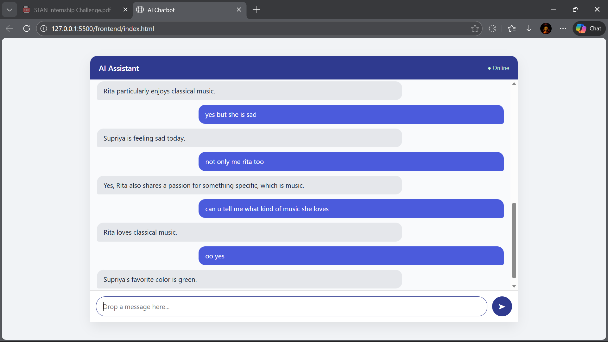

AI Chatbot with Memory (Full-Stack Project)

It is a full-stack AI chatbot designed to simulate human-like conversations with long-term memory.
The system remembers user-specific facts, retrieves them when needed, and responds concisely using a locally hosted Large Language Model (LLM).

This project is built  with a focus on memory-aware conversations, cost-efficient AI usage, and clean system architecture.

## Screenshots

### Chat Interface

--------------------------------------------------

Project Focus

The primary goals of this project are:

- Long-term memory across conversations
- Human-like and tone-aware responses
- Cost-efficient AI inference without paid APIs
- Clean, modular full-stack architecture
- Practical engineering decisions over complexity

--------------------------------------------------

Key Features

- Human-like conversational AI
- Persistent memory per user
- Reliable memory recall across messages
- Fast local inference (no cloud LLM cost)
- Tone-aware responses
- Modern, responsive frontend UI
- Secure environment configuration
- Modular backend architecture

--------------------------------------------------

System Architecture (High Level)

Frontend (HTML / CSS / JavaScript)
        |
        v
Express Backend (Node.js)
        |
        v
Memory Layer (MongoDB Atlas)
        |
        v
LLM Layer (Ollama → Mistral / LLaMA-2)

--------------------------------------------------

Request Flow

1. User sends a message from the frontend
2. Backend receives the request
3. User memory is fetched from MongoDB
4. Prompt is constructed using memory and system rules
5. Local LLM (via Ollama) generates a response
6. Memory is updated if new facts are detected
7. Response is sent back to the frontend

--------------------------------------------------

Memory Design

Each user has a persistent memory document stored in MongoDB Atlas.

Stored Fields:
- userId: Unique identifier for the user
- memorySummary: Summarized factual memory
- updatedAt: Timestamp of last update

Memory Rules:
- If information exists in memory, answer strictly from memory
- Do not hallucinate or invent facts
- If memory is missing, respond with uncertainty (e.g., “I’m not sure”)

This ensures consistent and reliable conversations.

--------------------------------------------------

Example Interaction

User:
Sita loves dancing.

Later…

User:
Do you know what Sita loves?

Bot:
Sita loves dancing.

This demonstrates:
- Correct memory recall
- No hallucination
- Short and natural response

--------------------------------------------------

Technology Stack

Frontend:
- HTML5
- CSS3 (responsive, modern UI)
- Vanilla JavaScript

Backend:
- Node.js
- Express.js
- Mongoose (MongoDB ODM)

Database:
- MongoDB Atlas (cloud-hosted)

AI / LLM:
- Ollama (local LLM runtime)
- Mistral or LLaMA-2 (open-source models)

Development Tools:
- Git and GitHub
- dotenv for environment variables
- REST APIs (JSON)

--------------------------------------------------

Project Structure

STAN-Chatbot/
│
├── frontend/
│   ├── index.html
│   ├── style.css
│   └── script.js
│
├── backend/
│   ├── models/
│   │   └── UserMemory.js
│   ├── routes/
│   │   └── chat.js
│   ├── services/
│   │   └── ollamaService.js
│   ├── server.js
│   └── package.json
│
├── .gitignore
├── README.md
└── .env (not committed)

--------------------------------------------------

Setup and Installation

1. Clone the Repository

git clone https://github.com/Supriyasharma12/AI-Chatbot.git
cd STAN-Chatbot

--------------------------------------------------

2. Backend Setup

cd backend
npm install

Create a .env file in the backend directory:

PORT=5000
MONGO_URI=My mongodb string

--------------------------------------------------

3. Install and Run Ollama

Download Ollama:
https://ollama.com

Pull a model:

ollama pull mistral
or
ollama pull llama2:7b

Verify Ollama is running:

curl http://127.0.0.1:11434/api/tags

--------------------------------------------------

4. Start Backend Server

node server.js

Expected output:
Server is running on port 5000
MongoDB Atlas connected

--------------------------------------------------

5. Frontend Setup

Open frontend/index.html directly in a browser
or
Serve it using Live Server or any static server.

--------------------------------------------------

API Endpoint

POST /chat

Request Body:
{
  "userId": "user123",
  "message": "I am feeling sad today"
}

Response:
{
  "reply": "I’m sorry you’re feeling sad. Want to talk about it?"
}

--------------------------------------------------

LLM Prompt Strategy

The chatbot follows strict response rules:
- Short responses (maximum 3 sentences)
- No over-explaining
- No motivational speeches
- Memory-first answers
- Natural, human-like tone
- At most one short follow-up question

This prevents robotic or verbose replies.

--------------------------------------------------

Cost Efficiency

- Uses local LLMs via Ollama
- No paid API calls
- MongoDB Atlas free tier
- Stateless backend with stateful memory store
- Designed to scale with minimal runtime cost

--------------------------------------------------

Security and Best Practices

- Environment variables stored in .env
- .gitignore excludes:
  - node_modules
  - .env
- No API keys committed
- Clean, modular, maintainable codebase

--------------------------------------------------

Author

Supriya Sharma
